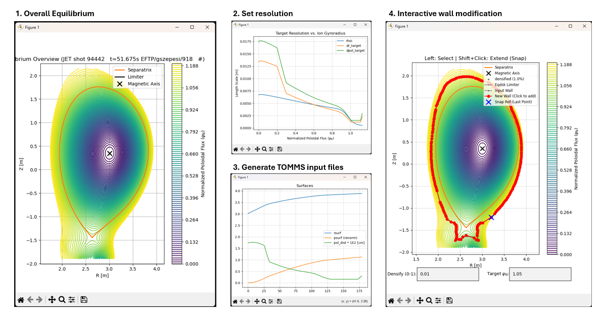
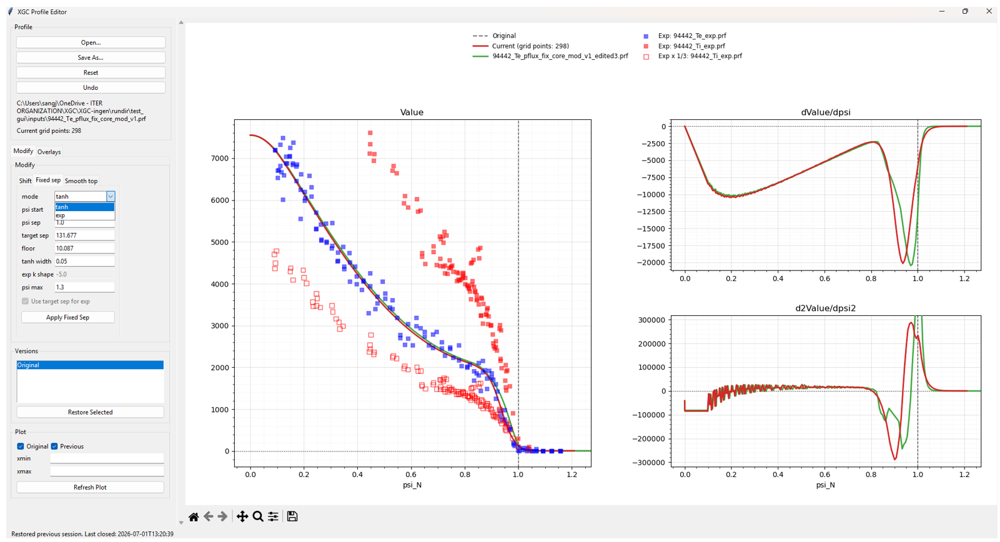
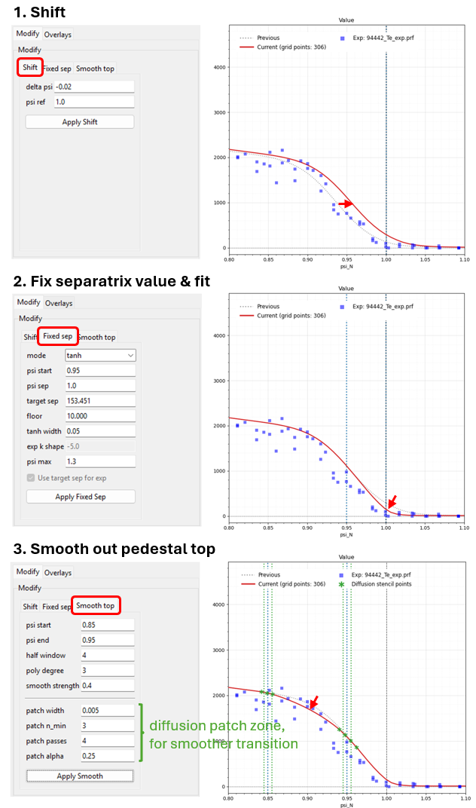

# XGC_ingen
Python workflow for preparing TOMMS mesh generation

# Example usage
```sh
mkdir rundir
cd rundir

# After preparing 'inputs' and 'params.in'
python ../xgc_ingen.py
```



# Profile editor
## Common GUI workflow

```sh
python utils/profile_gui.py
```



## Optional GUI launch with files

```sh
python utils/profile_gui.py path/to/profile.prf --overlay path/to/experiment.prf
```

## Supported features

### Comparison and output
- original/previous/current comparison with value, first derivative, and second derivative views
- saving the modified profile back to TOMMS `.prf` format

### Profile modifications
- radial psi-axis shifting
- pedestal-top smoothing with C1 cubic flattening and optional post-diffusion passes in boundary patches
- fixed-separatrix tanh or exponential connection with SOL floor


